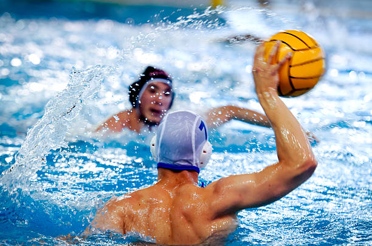

# Mijn hobby
Waterpolo is een snelle teamsport in het water, waarbij twee teams proberen te scoren door de bal in het doel van de tegenstander te gooien. Het combineert zwemmen, tactiek en fysieke kracht, en is sinds 1900 een Olympische sport.

## Mijn favorite activiteiten
- passen
- scoren
- zwemmen
- aanvallen
- verdedigen

## hoe beginnen in deze hobby
1. leren zwemmen
2. leren passen
3. leren verdedigen
4. leren scoren

[waterpolo](https://nl.wikipedia.org/wiki/Waterpolo)

if goal==OPEN:
    shootball=yes
else:
    shootball=no